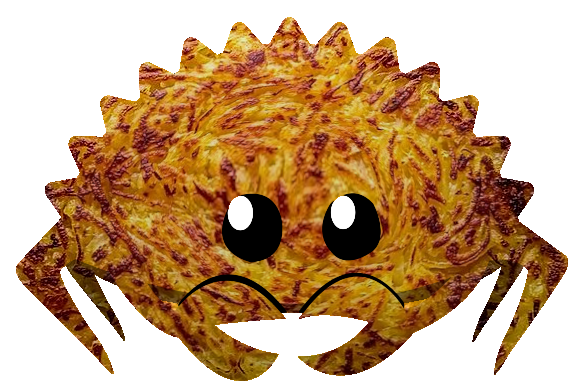

# rösti

<p align="center"></p>

Aren't you _huere müed_ from writing Rust programs in English? Do you like saying
*"gopferdämmi!"* a lot? Would you like to try something different, in an exotic and
funny-sounding language? Would you want to bring some Swiss touch to your
programs?

**Rösti** is here to save your day, as it allows you to
write Rust programs in Swiss German, using Swiss German keywords, Swiss German
function names, Swiss German idioms.

You don't feel at ease using only Swiss German words? Don't worry!
Swiss German Rust is fully compatible with English-Rust, so you can mix both at your
convenience.

Here's an example of what can be achieved with Rösti:

```rust
roesti::roesti! {
    benutze std::sammlige::Wörterbuech als Wöbu;

    eigedschaft SchlüsselWärt {
        funktion schriib(&selbst, schlsl: Zeichäkette, wärt: Zeichäkette);
        funktion läs(&selbst, schlsl: Zeichäkette) -> Resultat<Mängisch<&Zeichäkette>, Zeichäkette>;
    }

    statisch änd WÖRTERBUECH: Mängisch<Wöbu<Zeichäkette, Zeichäkette>> = Nüüt;

    struktur Konkret;

    impl SchlüsselWärt für Konkret {

        funktion schriib(&selbst, schlsl: Zeichäkette, wärt: Zeichäkette) {
            sei wöbu = gföhrlich {
                WÖRTERBUECH.hol_oder_füeg_ii_mit(Standard::standard)
            };
            wöbu.iifüge(schlsl, wärt);
        }

        funktion läs(&selbst, schlsl: Zeichäkette) -> Resultat<Mängisch<&Zeichäkette>, Zeichäkette> {
            wenn sei Öpis(wöbu) = gföhrlich { WÖRTERBUECH.als_ref() } {
                Gäbig(wöbu.hol(&schlsl))
            } suscht {
                gopferdämmi!("Reto, mir bruuched's WÖRTERBUECH")
            }
        }
    }
}
```

## Other examples

See the [examples](./examples/src/main.rs) to get a rough sense of the whole
syntax. *So isch lässig!*

## Credits

This joke started life in [French](https://github.com/bnjbvr/rouille). *Rösti* was based on the [German](https://github.com/michidk/rost) version thereof.

## Mitwirken

Not a native speaker of Swiss German, so help is welcome! *Merci vielmal!*
Feel free to throw in a few identifiers here and there, and open a
pull-request against the `hauptzweig` (German for `main branch`).

## D'Lizenzbestimmige

[WTFPL](http://www.wtfpl.net/).

