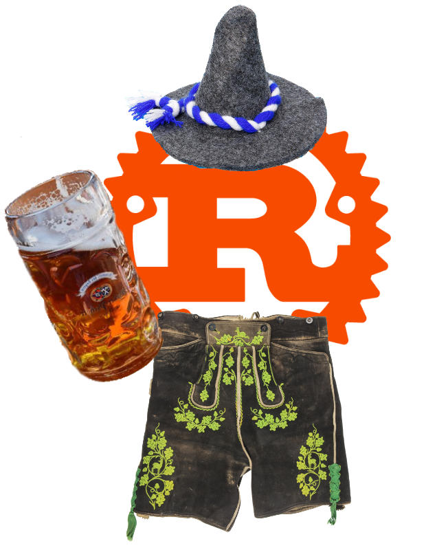

# rost

<p align="center"></p>

Aren't you _müde_ from writing Rust programs in English? Do you like saying
"scheiße" a lot? Would you like to try something different, in an exotic and
funny-sounding language? Would you want to bring some German touch to your
programs?

**rost** (German for _Rust_) is here to save your day, as it allows you to
write Rust programs in German, using German keywords, German function names,
German idioms.

You don't feel at ease using only German words? Don't worry!
German Rust is fully compatible with English-Rust, so you can mix both at your
convenience.

Here's an example of what can be achieved with Rost:

## struct and impl (aka Konvention und Umsetzung)

```rust
rost::rost! {
    benutze std::sammlungen::Wörterbuch als Wöbu;

    eigenschaft SchlüsselWert {
        funktion schreibe(&selbst, schlsl: Zeichenkette, wert: Zeichenkette);
        funktion lese(&selbst, schlsl: Zeichenkette) -> Ergebnis<Möglichkeit<&Zeichenkette>, Zeichenkette>;
    }

    statisch änd WÖRTERBUCH: Möglichkeit<Wöbu<Zeichenkette, Zeichenkette>> = Nichts;

    struktur Konkret;

    umstz SchlüsselWert für Konkret {

        funktion schreibe(&selbst, schlsl: Zeichenkette, wert: Zeichenkette) {
            lass wöbu = gefährlich {
                WÖRTERBUCH.hole_oder_füge_ein_mit(Standard::standard)
            };
            wöbu.einfügen(schlsl, wert);
        }

        funktion lese(&selbst, schlsl: Zeichenkette) -> Ergebnis<Möglichkeit<&Zeichenkette>, Zeichenkette> {
            wenn lass Etwas(wöbu) = gefährlich { WÖRTERBUCH.als_ref() } {
                Gut(wöbu.hole(&schlsl))
            } anderenfalls {
                Fehler("Holt das Wörterbuch".hinein())
            }
        }
    }
}
```

## Other examples

See the [examples](./examples/src/main.rs) to get a rough sense of the whole
syntax. Gut so!

## but why would you do das?

* the [French](https://github.com/bnjbvr/rouille) and [Dutch](https://github.com/jeroenhd/roest) can do it, so we can as well!

## Mitwirken

First of all, _vielen Dank_ for considering participating to this joke, the
German government will thank you later! Feel free to throw in a few identifiers
here and there, and open a pull-request against the `hauptzweig` (German for
`main branch`). The initial translation was made by [Shemnei](https://github.com/Shemnei/) and [michidk](https://github.com/michidk/).

## Die Lizenzbestimmungen

[WTFPL](http://www.wtfpl.net/). The images do not fall under this license, see below.

Image attributions:
* "Brezel und Filzhut zum Oktoberfest" by Tim Reckmann | a59.de is licensed under CC BY 2.0
* "Lederhose" is licensed under CC BY-NC-SA 4.0
